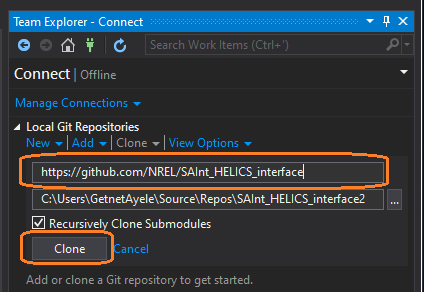
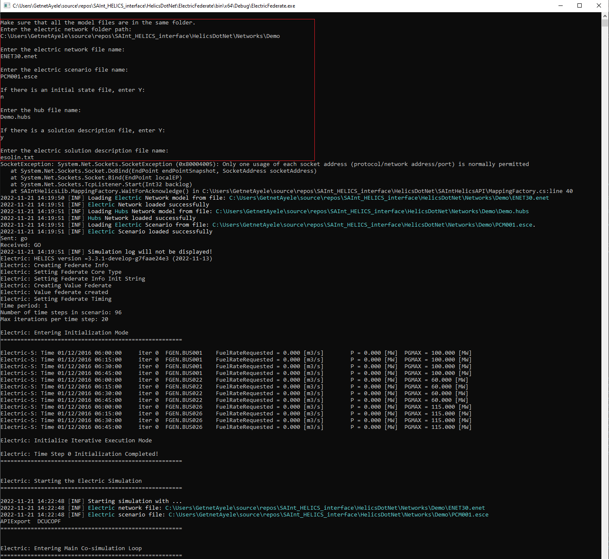

## Overview

This *SAInt_HELICS_interface* project runs electricity (unit commitment) and gas (dynamic) networks that are coupled through gas-fired power plants using the [HELICS co-simulation platform](https://docs.helics.org/en/latest/). In this setup the two networks are modeled as independent federates with the SAInt software, while the relevant values and messages are exchanged between the two federates via the HELICS platform. 

This repository includes the adapter code to utilize HELICS with SAInt, as well as data for three case studies (Demo-base, Demo-Alternate, and Belgian), each of them with two different scenarios (normal and compressor outage). Note that the two Demo case studies can be simulated using the trial version of SAInt (availble for free by contacting [encoord](https://www.encoord.com/ContactUs.html)), but the Belgian network requires a full SAInt license. 

Additional details on this interface and the work developing HELICS support for SAInt are available [here](https://www.encoord.com/CaseStudyHELICS.html#top).  

## System requirements 

   - Windows Operating System (any of Windows 7, 8 or 10 running either 32-Bit or 64-Bit versions)
   - SAInt 3.2 (Demo version available for free by contacting [encoord](https://www.encoord.com/ContactUs.html)).
   - Visual Studio (Visual Studio Community is available for free from [Microsoft](https://visualstudio.microsoft.com/free-developer-offers/)).
   - Recommended minimum specifications:
      - 2GHz CPU
      - 4GB RAM
      - 5GB Available HDD space after application installs
      - Network Card
      - 15-inch screen with a resolution of at least 1280x960 pixels
      - USB port

## Setting up the SAInt_HELICS interface 

This user guide describes the steps for setting up and running the *SAInt_HELICS_interface* project on *Visual Studio*. It is divided into four sections:
- [Clone the SAInt_HELICS_interface to your working space](#Clone-the-SAInt_HELICS_interface-to-your-working-space)
- [Loading the visual studio project ](#Loading-the-visual-studio-project)
- [Set the project configuration as a multiple startups](#Set-the-project-configuration-as-a-multiple-startups)
- [Configure the solution platform and run the simulation](#Configure-the-solution-platform-and-run-the-simulation)

#### Clone the SAInt_HELICS_interface to your working space
  1. Open visual studio.
  2. Go to the *Team* tab and then *Manage Connections*. Alternatively, you can also directly access this by opening the *Team Explorer* from the *View* tab. Also, open the *Solution Explorer* from the *View* tab if it is not opened.
  3. In the *Team Explorer*, go to *Local Git Repositories* and click *Clone* (see Figure 1 below).
     
   || 
   |:--:|
   |<b>Figure 1</b>|

  4. In the dialog box that opens, put the URL address of the SAInt_HELICS_interface. Browse the destination directory to point to your workspace folder. Then click *Clone* and wait until it is completed (see Figure 2). The link for the URL is: https://github.com/NREL/SAInt_HELICS_interface
     
   ||
   |:--:|
   |<b>Figure 2</b>|

  5. Once cloning is completed, the *SAInt_HELICS_interface* appears in your *Team Explorer* Local Git Repository Section (Figure 3).
     
   ||
   |:--:|
   |<b>Figure 3</b>|
   
#### Loading the visual studio project 
  1. Double click the *SAInt_HELICS_interface* to open it. It should look like as shown in Figure 4. Make sure that the branch *DCUCOPF_DynGas* is selected. Then you will see the *SAInt_HELICS.sln* in the solution section of *Team Explorer*.

   ||
   |:--:|
   |<b>Figure 4</b>|

  2. Double click *SAInt_HELICS.sln* to open the project in the *Solution Explorer*. Your *Solution Explorer* will look like as shown in Figure 5.
  
   ||
   |:--:|
   |<b>Figure 5</b>|

  3. There are five projects embedded in the *SAInt_HELICS* solution.
     - *ElectricFederate* loads the electric network, imports the corresponding scenario definitions and run the simulation. Make sure that this project has a reference to *SAInt_Core.dll* which is found in the SAInt installation folder. The default path is: *C:\Program Files\encoord\SAInt x.xx\SAInt-Core.dll*.
     - *GasFederate* loads the gas network, imports the corresponding scenario definitions and run the simulation. Make sure that this project has a reference to *SAInt_Core.dll* which is found in the SAInt installation folder. The default path is: *C:\Program Files\encoord\SAInt x.xx\SAInt-Core.dll*.
     - *GasElectricBroker* creates a brokered environment through which the two federates communicate.
     - *HelicsDotNetAPI* provides the API functionality required for the co-simulation *HELICS* environment.
     - *SAIntHelicsLib* provides the mapping factory for the coupling technologies. It has functions that are used to initialize events, generate publication and subscription ids, receive, process and publish data that is communicated between electric and gas federates. Make sure that this project has a reference to *SAInt_Core.dll* which is found in the SAInt installation folder. The default path is: *C:\Program Files\encoord\SAInt x.xx\SAInt-Core.dll*.

#### Set the project configuration as a multiple startups
  1. At the top of the *Solution Explorer* right click on the *Solution 'HelicsDotNet'* and open *Set StartUP Projects* as shown in Figure 6. 
    
   || 
   |:--:|
   |<b>Figure 6</b>|

  2. In the dialog box that opens, set the *GasElectricBroker*, *ElectricFederate* and the *GasFederate* to *Start* (see Figure 7). 
    
   || 
   |:--:|
   |<b>Figure 7</b>|

  3. Press *Apply* and then *OK*.
   
#### Configure the solution platform and run the simulation
  1. Configure the solution platform, which is found next to the *Debug* button, to *x64* as shown in Figure 8. 
    
   ||
   |:--:|
   |<b>Figure 8</b>|

  2. Make sure all the network, scenario, state and solution description files of both electric and gas networks are located in the same folder. Simulate by clicking the green button *Start* in Figure 9. 
    
   ||
   |:--:|
   |<b>Figure 9</b>|

  3. Three processes will open up: one for the broker, one for the gas federate and another for the electric federate. Follow the instructions in the gas and electric process and input the path to the network folder and different files names (including their extension). Figures 10, 11 and 12 shows inputs for the example use case included in the "..\Network\Demo\" folder.    
   
   ||
   |:--:|
   |<b>Figure 10: Broker log window</b>| 
   ||
   |<b>Figure 11: Electric federate log window</b>|
   ||
   |<b>Figure 12: Gas federate log window</b>|

  4. The logs will be displayed on the three command windows.
  5. Once the simulation is completed, the solution files, scenario events and iteration information will be exported to the *Outputs* sub-folder inside your network folder.
