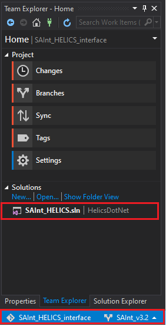
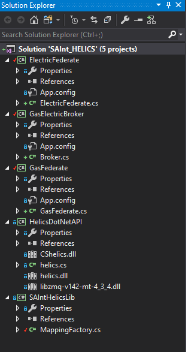

#### a) Clone the SAInt_HELICS_interface to your working space
  1. Open visual studio.
  2. Go to the *Team* tab and then *Manage Connections*. Alternatively, you can also directly access this by opening the *Team Explorer* from the *View* tab. Also, open the *Solution Explorer* from the *View* tab if it is not opened.
  3. In the *Team Explorer*, go to *Local Git Repositories* and click *Clone* (see Figure 1 below).
     
   || 
   |:--:|
   |<b>Figure 1</b>|

  4. In the dialog box that opens, put the URL address of the SAInt_HELICS_interface URL. Select the destination to your workspace folder. Then click *Clone* and wait until it is completed (see Figure2). The link for the URL is: https://github.com/NREL/SAInt_HELICS_interface
     
   ||
   |:--:|
   |<b>Figure 2</b>|

  5. Once cloning is completed, the SAInt_HELICS_interface appears in your *Team Explorer*. You will also see the *HelicsDotNet.sln* solution (Figure 3). 
     
   ||
   |:--:|
   |<b>Figure 3</b>|

#### b) Loading the visual studio project 
  1. Double click the *HelicsDotNet.sln* solution file to load the associated visual studio project file. 
  2. Now your *Solution Explorer* looks like as shown in Figure4. 
     
   ||
   |:--:|
   |<b>Figure 4</b>|

#### c) Set the project configuration as a multiple startups
  1. At the top of the *Solution Explorer* right click on the *Solution 'HelicsDotNet'* and open *Set StartUP Projects* as shown in Figure5 and Figure6. 
    
   ||
   |:--:|
   |<b>Figure 5</b>|
   || 
   |:--:|
   |<b>Figure 6</b>|
  2. In the dialog box that opens, set the *ElectricFederate* and the *GasFederate* to *Start* (see Figure7). 
    
   || 
   |:--:|
   |<b>Figure 7</b>|

  3. Close the dialog box.
#### d)_Configure the solution platform and run the simulation
  1. Configure the solution platform to *x64* as shown in Figure8. 
    
   ||
   |:--:|
   |<b>Figure 8</b>|

  2. Simulate by clicking the green button *Start* in the above Figure9.
    
   ||
   |:--:|
   |<b>Figure 9</b>|

  3. The log files will be displayed on two command windows: one for the electric network and another for the gas network.
  4. Once the simulation is completed, the exported solution files will be found in your workspace�s *Output* folder.
